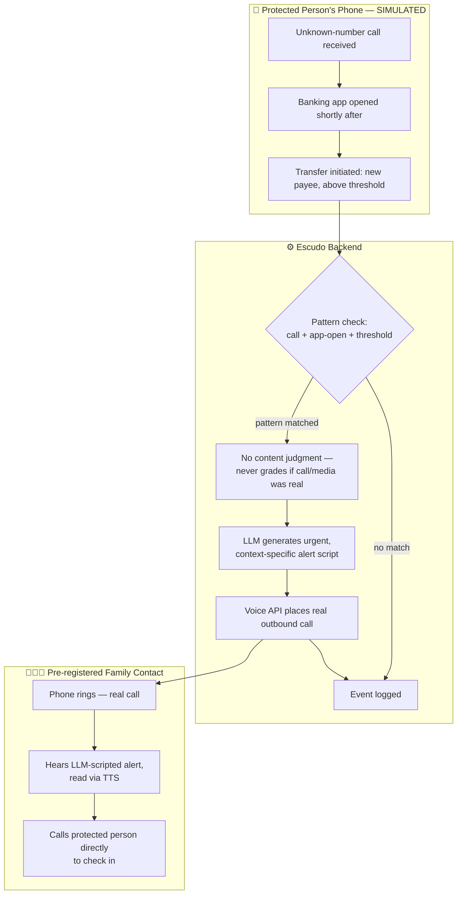

# PACKET — Week 3 — Business Bending
### Escudo · Emilio Gómez González · Adversary → Family Shield
### Chapter 2, Gods Behind the Masks — When Nothing Can Be Verified

---

## 1. Problem, in my words

Voice cloning a family member now takes a few seconds of public audio and zero specialized
skill — a fact every role on my team independently confirmed. The FBI and FTC both recommend a
free "family safe word" as the baseline defense, but free-and-recommended doesn't mean adopted:
15 years of free 2FA advice still sits at ~30% adoption. Worse, the Mexican version of this scam
is engineered specifically to defeat a safe word — "no cuelgues, no le digas a nadie" — by
inducing panic that skips the protocol entirely.

I spent a full argued session with my own first answer before landing here. My original mechanism
tried to intervene during the call (impossible — WhatsApp calls are end-to-end encrypted, no
outside app can listen in) and then tried to intervene by pausing the bank transfer itself
(impossible — SPEI settlement is legally irrevocable in seconds per Banxico Circular 14/2017,
confirmed directly against Banxico's own regulatory text). Both walls are structural, not
technology gaps that improve with better models.

What's actually buildable, and honest: the intervention has to happen on the victim's own phone,
before she finishes authorizing the transfer, using a behavioral pattern she can't be talked out of
in the panic window — and it has to get a real human, not a text she can dismiss, into the loop
fast.

## 2. Exact user

**Primary — the protected person:** an older adult in Mexico, Android phone, modest income,
manages her own banking app but isn't a habitual app-installer, gives up silently when confused.
The stated primary target of this exact scam.

**Secondary — the family contact:** an adult child or relative who wants to be reachable the
instant something looks wrong, but can't watch her phone constantly.

## 3. Success definition

Before the module closes: submitting a simulated risk event (an unknown-number call followed by
banking-app activity above a configured threshold, to a new payee) triggers one real, live
phone call — placed by the system, not a push notification — to the pre-registered family
contact's actual phone number, reading an LLM-generated, context-specific alert script aloud via
text-to-speech, and the event is logged. At no point does the system claim to know whether any
call, voice, or video was itself fake.

## 4. Mockup

`docs/mockup_shield_dashboard.svg` — a generated wireframe of the two core screens: family setup
(protected person, emergency contact, alert threshold) and the simulated risk-event trigger with
alert history. *(For a higher-fidelity version, paste into an image generator: "Two mobile app
screens side by side, plain flat UI, Spanish-language. Left: a family safety setup form with
fields for a protected person's name, an emergency contact phone number, and an alert threshold
amount, with a note reading 'Este sistema nunca analiza si una llamada es falsa.' Right: a
labeled-simulated risk event card showing an unknown-number call and a bank-app-open event, a red
'Disparar alerta' button, and a green success log entry reading 'Llamada realizada al contacto
familiar.' Clean sans-serif, high contrast, no logos.")*

## 5. Flow (Mermaid, swimlanes)

## 6. Benchmark line

The best existing solution on Earth for this is **Antigrift** ($19/month, US family plan) —
already confirmed live: safe-word reminders, AI call/text screening, a toll-free forward-a-recording
number, no app to install.

Mine differs by triggering on an actual on-device behavioral pattern (call, then banking-app
activity, then a specific transfer) rather than requiring anyone to forward anything, and localizes
by delivering the alert as a real synthesized voice call rather than an SMS to a toll-free US
number — because Antigrift is phone-and-SMS native with zero WhatsApp integration, and the
Mexican version of this scam runs almost entirely over WhatsApp voice notes, not carrier SMS.

## 7. The long view (3 years)

If this slice works, it becomes a standing background service on the protected person's own
phone — not a dashboard she has to check, but a silent layer that only ever speaks up once, fast,
to someone who can act. Over three years, the pattern-detection layer (currently simulated) could
move to a real Android accessibility/usage-access service once tested safely across device tiers,
and the alert channel could extend beyond one family contact to a small trusted circle with
smarter escalation. The business model stays a flat family-plan fee, never a cut of anything
recovered, so the incentive stays on catching the pattern fast, not on monetizing the aftermath.

## 8. Scope cut — NOT building this week

- No real Android background service, call-log listener, or usage-access integration — the
  on-device detection is simulated and clearly labeled; this week proves the response pipeline,
  not the native sensor layer.
- No real SPEI or bank API integration, and no attempt to pause, block, or reverse any transfer —
  confirmed structurally impossible within a week (or possibly ever, for a third party).
- No audio or video authenticity analysis of any kind — explicitly the forbidden zone.
- No multi-contact escalation chains, no scoring of the protected person's "risk level."
- No support for iOS in the design (Android's usage-access APIs are the only viable future path;
  iOS restricts this — stated honestly, not discovered later).

## 9. Architecture + stack

| Layer | Choice | Why |
|---|---|---|
| Frontend | Next.js on Vercel | free tier, fast deploys, matches course floor |
| Auth | Supabase Auth, Google sign-in | protects the family-contact data behind a real login |
| Database | Supabase Postgres, RLS ON | a family sees only its own contacts, thresholds, and event log |
| Event trigger | A labeled "Simulate Event" form | stands in for the real on-device detector, honestly |
| Script generation | LLM (Gemini free tier) | turns a raw event into a short, calm, specific alert script |
| Alert delivery | Voice API (Twilio, trial/free tier) | places a real outbound call, reads the script via TTS |
| Secrets | Vercel environment variables | no keys in the repo |

## 10. Test plan

1. **No-match test** — submit an event below threshold or to a known payee → expect no call
   placed, event logged as "no match."
2. **Match test** — submit a qualifying event → expect exactly one real outbound call placed to
   the registered contact, with a script that references the specific event details.
3. **Script honesty test** — read the generated script aloud; it must never claim the original
   call or video was confirmed fake — only that a pattern was detected.
4. **RLS test** — confirm one family's contacts and events are invisible to another account.
5. **Mechanical pass** — run the flow end-to-end on the deployed URL, find a real bug, fix it,
   redeploy.
6. **Persona test** — walk a synthetic "Doña Mari" persona through the setup screen only (she's
   never meant to see the alert — it goes to the family contact), and separately walk a synthetic
   "worried adult child" persona through receiving and acting on the call.
